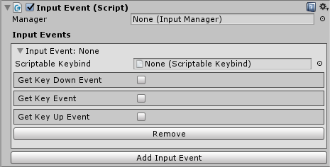
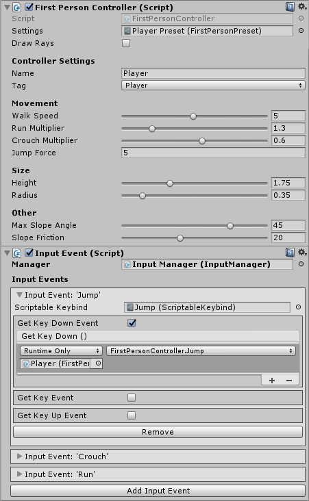
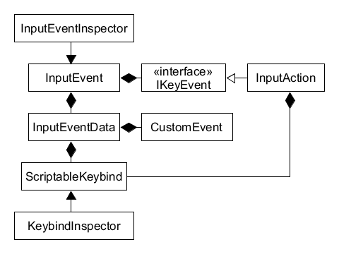

# FPController
Simple First Person Rigidbody Controller and input manager for Unity Game Engine.  
Controller provides basic first person controls using rigidbody and input managers allows binding functions to keys inside the editor.  
  
Made in Unity 2017.3.0f3

# Download
Download the latest unity package from [releases](https://github.com/nupsi/FPController/releases).  
Package contains example scene and scripts for the controller and the input manager.

## First Person Controller
Uses rigidbody and capsule collider with physics material to form a first person controller.
Controller contains preset defining each property of the controller.  

  
Window for creating First Person Controller.

  
Inspector for preset containing controllers properties.

## Input Manager / Input Event
Binds public functions to keyboard events. One event contains scriptable keybind and keyboard events that are called. Single keyboard event can contain one or more functions.  
Once the game start Input Event registers its events to a input manager. If there is no reference to a dedicated input manager the input event adds one to its game object. Dedicated input managers can be used to control differend inputs by activating and deactivating required managers.  
Scriptable keybind can contain one or more primary key codes and multiple combination key codes. Single primary key and all the combination keys are required to trigger a event.  

  
Inspector for input event.

  
Scriptable Keybind for input event.

  
Example of Input Event binding Jump to Space.

#### See
- [Get Key Down](https://docs.unity3d.com/ScriptReference/Input.GetKeyDown.html)  
- [Get Key](https://docs.unity3d.com/ScriptReference/Input.GetKey.html)  
- [Get Key Up](https://docs.unity3d.com/ScriptReference/Input.GetKeyUp.html)  
- [Key Code](https://docs.unity3d.com/ScriptReference/KeyCode.html)  

## Simple Class Diagrams

  
First Person Controller

  
Input Event
